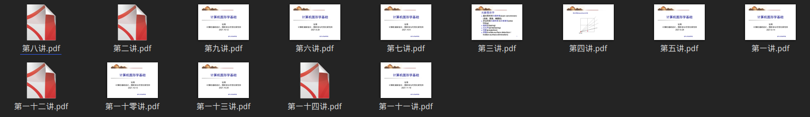
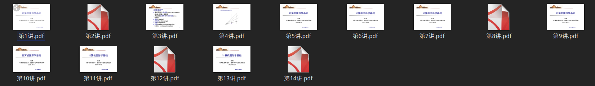

# chinese_number_filename_converter

文件名中英文数字互转的小工具，基于 chinese2digits.

## 适用场景

当你看到这样一坨排序后的文件，发现排序都是乱的，是不是很想提起 40m 长的大刀砍死作者：


于是我开发了这个小工具，专门用来处理这种逆天的中文数字。

## 依赖安装
```shell
pip install -r requirements.txt
```

## 基本用法

查看帮助:
```shell
python main.py -h
```

Basic usage:
```
usage: main.py [-h] [-t {c2a,a2c}] paths [paths ...]

将文件名的中文数字与阿拉伯数字互相转化的工具

positional arguments:
  paths                 文件或者文件夹的路径，支持通配符

optional arguments:
  -h, --help            show this help message and exit
  -t {c2a,a2c}, --type {c2a,a2c}
                        c2a 将中文转为阿拉伯，a2c 将阿拉伯转为中文，默认为 c2a
```

## 使用例
```shell
python main.py *.pdf
```

得到结果：


现在看起来舒服了.
